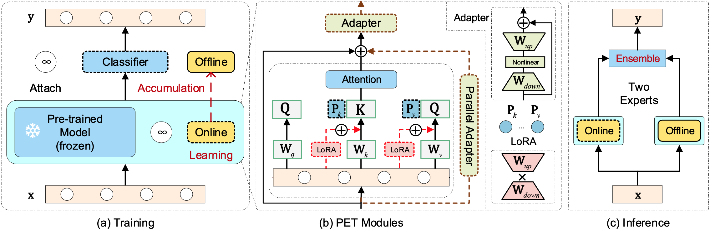

## A Unified Continual Learning Framework with General Parameter-Efficient Tuning

### 🥺🙏🙇 I apologize for the delay in releasing the code.  I still need some time to clean and test my code. 



The official PyTorch implementation of LAE introduced in the following paper:

> [Qiankun Gao](https://github.com/gqk), Chen Zhao, Yifan Sun, Teng Xi, Gang Zhang, Bernard Ghanem, [Jian Zhang](https://github.com/jianzhangcs);
>
> A Unified Continual Learning Framework with General Parameter-Efficient Tuning;
>
> arXiv preprint arXiv:2303.10070, 2023.

## Introduction

The "pre-training → downstream adaptation" presents both new opportunities and challenges for Continual Learning (CL). Although the recent state-of-the-art in CL is achieved through Parameter-Efficient-Tuning (PET) adaptation paradigm, only prompt has been explored, limiting its application to Transformers only. In this paper, we position prompting as one instantiation of PET, and propose a unified CL framework with general PET, dubbed as Learning-Accumulation-Ensemble (LAE). PET, e.g., using Adapter, LoRA, or Prefix, can adapt a pre-trained model to downstream tasks with fewer parameters and resources. Given a PET method, our LAE framework incorporates it for CL with three novel designs. 1) Learning: the pre-trained model adapts to the new task by tuning an online PET module, along with our adaptation speed calibration to align different PET modules, 2) Accumulation: the task-specific knowledge learned by the online PET module is accumulated into an offline PET module through momentum update, 3) Ensemble: During inference, we respectively construct two experts with online/offline PET modules (which are favored by the novel/historical tasks) for prediction ensemble. We show that LAE is compatible with a battery of PET methods and gains strong CL capability. For example, LAE with Adaptor PET surpasses the prior state-of-the-art by 1.3% and 3.6% in last-incremental accuracy on CIFAR100 and ImageNet-R datasets, respectively.


## Experiment

- Install dependencies

    ```shell
    pip install -r requirements.txt
    ```
- Prepare datasets

    1. create a dataset root diretory, e.g., data
    2. `CIFAR100` and `ImageNet-R` datasets will be automatically downloaded
    3. the overview of dataset root diretory

        ```shell
        ├── cifar100
        │   └── cifar-100-python
        └── imagenet-r
            ├── imagenet-r
            ├── train_list.txt
            └── val_list.txt
        ```

- Generate config file (replace `<root>` with your dataset root path)

    ```shell
    python main.py data.root=<root> data.dataset=cifar100 --print_config > cifar100.yaml
    ```

- Run experiment

    ```shell
    python main.py --config=cifar100.yaml
    ```

We provide [configs](./config) and [Makefile](./Makefile) to quickly reproduce the ten-tasks experimental results reported in the paper, run the following command if the `make` has been installed:

```shell
make vit_adapter
make vit_lora
make vit_prefix
make swin_adapter
make convnext_adapter
```

Run `make` command with `BASE` arg (default is `base/cifar100_order1.yaml`) to reproduce other experiments, e.g.:
```
make BASE="base/imagenet-r_order1.yaml" vit_adapter
```

Modifiy `data.num_increment_classes` (`5/10` for CIFAR100/ImageNet-R) in base config files to reproduce `20-task` experiments.

## Citation

```
@article{gao2022lae,
  title={A Unified Continual Learning Framework with General Parameter-Efficient Tuning},
  author={Qiankun Gao, Chen Zhao, Yifan Sun, Teng Xi, Gang Zhang, Bernard Ghanem, Jian Zhang},
  journal={arXiv preprint arXiv:2303.10070},
  year={2023}
}
```
