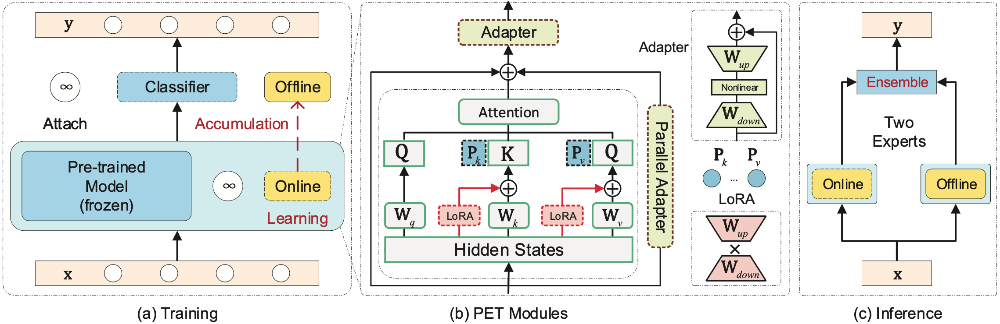

## A Unified Continual Learning Framework with General Parameter-Efficient Tuning



The official PyTorch implementation of LAE introduced in the following paper:

> [Qiankun Gao](https://github.com/gqk), [Chen Zhao](https://zhao-chen.com/), [Yifan Sun](https://yifansun-reid.github.io), Teng Xi, Gang Zhang, [Bernard Ghanem](https://www.bernardghanem.com/), [Jian Zhang](https://github.com/jianzhangcs);
>
> A Unified Continual Learning Framework with General Parameter-Efficient Tuning;
>
> International Conference on Computer Vision (ICCV), 2023.

## Introduction

The "pre-training → downstream adaptation" presents both new opportunities and challenges for Continual Learning (CL). Although the recent state-of-the-art in CL is achieved through Parameter-Efficient-Tuning (PET) adaptation paradigm, only prompt has been explored, limiting its application to Transformers only. In this paper, we position prompting as one instantiation of PET, and propose a unified CL framework with general PET, dubbed as Learning-Accumulation-Ensemble (LAE). PET, e.g., using Adapter, LoRA, or Prefix, can adapt a pre-trained model to downstream tasks with fewer parameters and resources. Given a PET method, our LAE framework incorporates it for CL with three novel designs. 1) Learning: the pre-trained model adapts to the new task by tuning an online PET module, along with our adaptation speed calibration to align different PET modules, 2) Accumulation: the task-specific knowledge learned by the online PET module is accumulated into an offline PET module through momentum update, 3) Ensemble: During inference, we respectively construct two experts with online/offline PET modules (which are favored by the novel/historical tasks) for prediction ensemble. We show that LAE is compatible with a battery of PET methods and gains strong CL capability. For example, LAE with Adaptor PET surpasses the prior state-of-the-art by 1.3% and 3.6% in last-incremental accuracy on CIFAR100 and ImageNet-R datasets, respectively.


## Experiment

- Install dependencies

    ```shell
    pip install -r requirements.txt
    ```
- Prepare datasets

    1. create a dataset root diretory, e.g., data
    2. `CIFAR100` and `ImageNet-R` datasets will be automatically downloaded
    3. the overview of dataset root diretory

        ```shell
        ├── cifar100
        │   └── cifar-100-python
        ├── domainnet
        │   ├── clipart
        │   ├── infograph
        │   ├── painting
        │   ├── quickdraw
        │   ├── real
        │   └── sketch
        └── imagenet-r
            ├── imagenet-r
            ├── train_list.txt
            └── val_list.txt
        ```

- Generate config file (replace `<root>` with your dataset root path)

    ```shell
    python main.py data.root=<root> data.dataset=cifar100 --print_config > cifar100.yaml
    ```

- Run experiment

    ```shell
    python main.py --config=cifar100.yaml
    ```

We provide [configs](./config) and [Makefile](./Makefile) to quickly reproduce the ten-tasks experimental results reported in the paper, run the following command if the `make` has been installed:

:warning: Please note that the **train-validation split of ImageNet-R dataset** and **ViT-B_16 pre-training checkpoint** are consistent with the [L2P JAX code](https://github.com/google-research/l2p), and are different from the split used in the latest [CODA-P paper](https://github.com/GT-RIPL/CODA-Prompt). Therefore, the results reported in our paper and CODA paper cannot be directly compared. For more details, please refer to the [More Experimental Results](#more-experimental-results).

```shell
make vit_adapter
make vit_lora
make vit_prefix
make swin_adapter
make convnext_adapter
```

Run `make` command with `BASE` arg (default is `base/cifar100_order1.yaml`) to reproduce other experiments, e.g.:
```
make BASE="base/imagenet-r_order1.yaml" vit_adapter
```

Modifiy `data.num_increment_classes` (`5/10` for CIFAR100/ImageNet-R) in base config files to reproduce `20-task` experiments.

## More Experimental Results

Recent paper CODA-P uses the different ImageNet-R train-validation split and pre-training checkpoint from ours. To enable a fair comparison, we conducted additional experiments on ImageNet-R with the same training settings as CODA-P and report the results in the table below.

The pre-training checkpoints can be found at [IN21K](https://storage.googleapis.com/vit_models/imagenet21k%2Bimagenet2012/ViT-B_16.npz) and [IN21K+1K](https://storage.googleapis.com/vit_models/augreg/B_32-i21k-300ep-lr_0.001-aug_medium1-wd_0.03-do_0.0-sd_0.0--imagenet2012-steps_20k-lr_0.03-res_224.npz), The key difference between them is the data augmentation, and IN21K+1K further fine-tunes on the ImageNet-1K dataset after pre-training on the ImageNet-21K dataset.

The train and validation list files of CODA-P split can be found at [train_list_coda-p.txt](https://gist.githubusercontent.com/gqk/e127fe18bf179bdcbdf5e29a8c1ae523/raw/train_list_coda-p.txt), [val_list_coda-p.txt](https://gist.githubusercontent.com/gqk/e127fe18bf179bdcbdf5e29a8c1ae523/raw/val_list_coda-p.txt), which are transformed from the [CODA-P code](https://github.com/GT-RIPL/CODA-Prompt).

| Approach       | Split   | Training Strategy   | ViT-B_16   | $A_{10} (↑)$| $\bar{A}_{10}(↑)$ |
|----------------|---------|---------------------|------------|-------------|-------------------|
|  CODA-P        | L2P     | DualPrompt          |   IN21K    | 61.38       | 73.10             |
| LAE (Prefix10) | L2P     | DualPrompt          |   IN21K    | 71.19       | 81.92             |
|  CODA-P        | L2P     | CODA-P              |   IN21K    | 70.34       | 78.07             |
| LAE (Prefix10) | L2P     | CODA-P              |   IN21K    | 72.27       | 79.97             |
|    CODA-P      | CODA-P  | CODA-P              | IN21K+1K   | 74.31       | 83.75             |
| LAE (Prefix10) | CODA-P  | CODA-P              | IN21K+1K   | 74.43       | 83.91             |

Our LAE achieves comparable performance to CODA-P using the CODA-P split and IN21K+1K checkpoint, while outperforming it using the L2P split and IN21K checkpoint (which is the setting used in L2P and DualPrompt). All experiments were conducted using the same 4 x Nvidia 3090 GPUs (modify the `strategy` and `devices` fields in config file).

We also compare our LAE with CODA-Prompt on 5-task DomainNet benchmark, results are shown below:

| Approach       | Training Strategy   | ViT-B_16   | $A_{5}(↑)$ | $F_{5}(↓)$  |
|----------------|---------------------|------------|------------|-------------|
|    CODA-P      |  CODA-P             | IN21K+1K   | 67.11      | 13.79       |
| LAE (Prefix10) |  CODA-P             | IN21K+1K   | 68.37      | 8.33        |

where $A_{5}$ and  $F_{5}$ are last incremental accuracy and last average forgetting, respectively.

## Acknowledgement

- We would like to thank [Jaeho Lee](https://github.com/JH-LEE-KR) for providing the PyTorch implementation of [L2P](https://github.com/JH-LEE-KR/l2p-pytorch) and [DualPrompt](https://github.com/JH-LEE-KR/dualprompt-pytorch), which served as a valuable reference for our code.

- We use datasets and scenarios provided by [continumm](https://github.com/Continvvm/continuum), an awesome data loading library for Continual Learning.

- The official JAX code of L2P and DualPrompt can be found [here](https://github.com/google-research/l2p).

- The official PyTorch code of CODA-P can be found [here](https://github.com/GT-RIPL/CODA-Prompt).

- The official PyTorch code of ESN can be found [here](https://github.com/iamwangyabin/ESN).

## Citation

```
@article{gao2023lae,
  title = {A Unified Continual Learning Framework with General Parameter-Efficient Tuning},
  author = {Qiankun Gao, Chen Zhao, Yifan Sun, Teng Xi, Gang Zhang, Bernard Ghanem, Jian Zhang},
  journal = {International Conference on Computer Vision (ICCV)},
  year = {2023}
}
```
